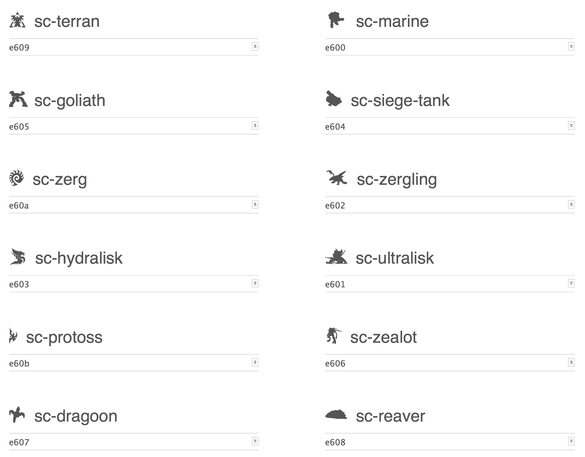

# Starcraft web icons (font-awesome style)

Made using Icomoon (http://icomoon.io/app/).  These are just for fun.  Use them in the same way you'd use font-awesome (copy the "fonts" subdirectory, and include the css file).

You won't need any of the files located under the *demo-files* directory when including the generated font in your own projects.

